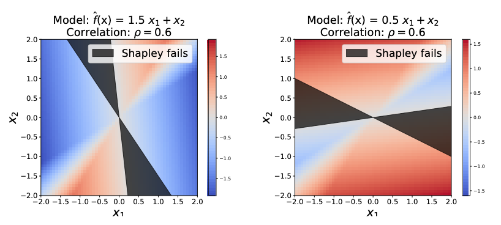
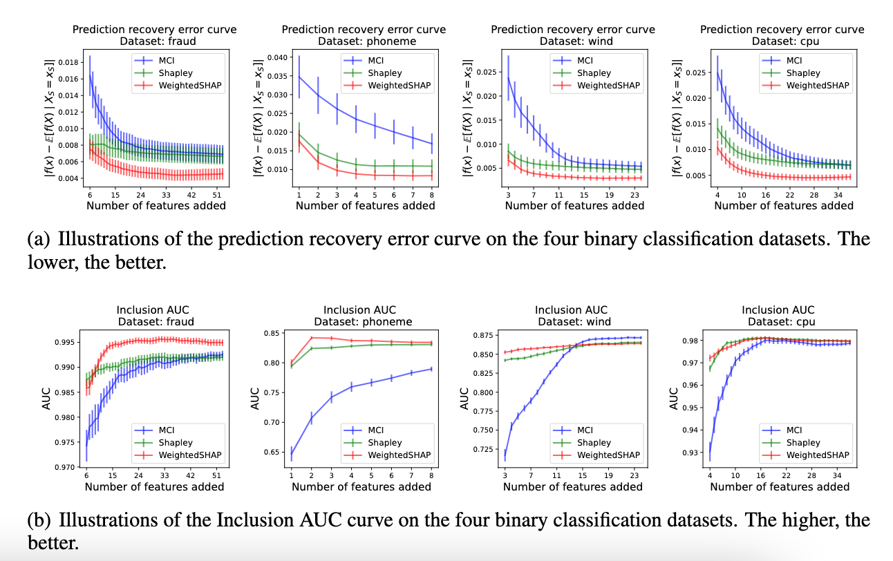
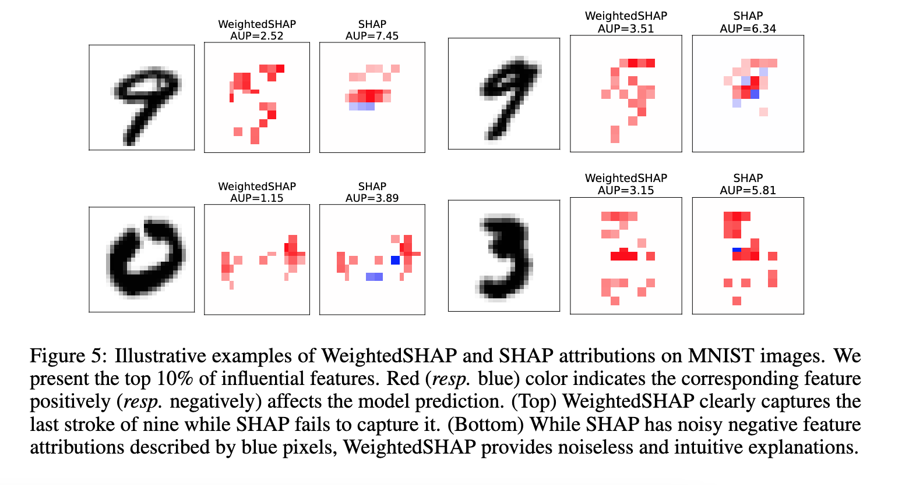

# WeightedSHAP: analyzing and improving Shapley based feature attributions

This repository provides an implementation of the paper *[WeightedSHAP: analyzing and improving Shapley based feature attributions](https://arxiv.org/abs/2209.13429)* accepted at [NeurIPS 2022](https://nips.cc/Conferences/2022). We show the suboptimality of SHAP and propose **a new feature attribution method called WeightedSHAP**. WeightedSHAP is a generalization of SHAP and is more effective to capture influential features. 

### Quick start

We provide an easy-to-follow [Jupyter notebook](notebook/Example_fraud_inclusion_AUC.ipynb), which introduces how to compute the WeightedSHAP on the Fraud dataset.

### Key results

&rarr; Illustrations of the suboptimality of Shapley-based feature attributions (SHAP) when $d=2$. ***Shapley value fails to assign large attributions to more influential features*** on grey area. 

&rarr; Illustrations of the prediction recovery error curve and the Inclusion AUC curve as a function of the number of features added.  ***WeightedSHAP effectively assigns larger values for more influential features*** and recovers the original prediction $\hat{f}(x)$ significantly faster than other state-of-the-art methods.

&rarr; ***WeightedSHAP can identify more interpretable features***. In particular, SHAP fails to capture the last stroke of digit nine, which is a crucially important stroke to differentiate from the digit zero.

### References

This repository highly depends on the following two repositories. 

- Covert, I., Lundberg, S. M., & Lee, S. I. (2021). Explaining by Removing: A Unified Framework for Model Explanation. J. Mach. Learn. Res., 22, 209-1. [[GitHub]](https://github.com/iancovert/removal-explanations)

- Jethani, N., Sudarshan, M., Covert, I. C., Lee, S. I., & Ranganath, R. (2021, September). FastSHAP: Real-Time Shapley Value Estimation. In International Conference on Learning Representations. [[GitHub]](https://github.com/iancovert/fastshap/tree/main/fastshap)

### Authors

- Yongchan Kwon (yk3012 (at) columbia (dot) edu)

- James Zou (jamesz (at) stanford (dot) edu)

